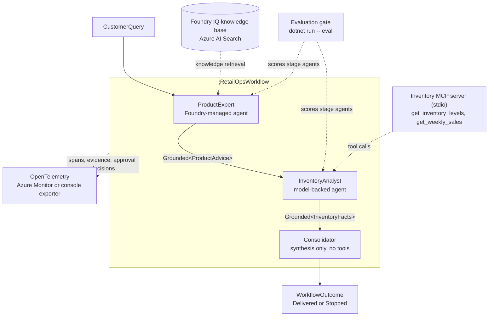

# Multi-agent solution with Microsoft Foundry


[](https://dotnet.microsoft.com/download/dotnet/10.0)
[](LICENSE)

A C# reference solution for the course capstone described in [GOAL.md](GOAL.md) (the original
assignment, in German): design, harden and operate a production-ready multi-agent solution on
Microsoft Foundry. The repository is organised as three chapters that build on each other. Each
chapter is a runnable .NET 10 project, and each step of the assignment has a working counterpart
here — a Foundry IQ knowledge base, Model Context Protocol (MCP) tools, a multi-agent workflow with
OpenTelemetry tracing, and a fail-closed evaluation gate.

The business scenario is a retail operations copilot. A customer question ("what helps with dry
skin, and is it in stock?") passes through three specialised agents: a product expert answering
only from the knowledge base, an inventory analyst reading stock and sales through MCP tools, and a
consolidator that merges both verified results into one recommendation for the customer and the
store.

## Architecture



A stage only receives values that the previous stage proved: `Grounded<T>` exists only when the
tool-call evidence satisfies that stage's requirement, so the pipeline order is enforced by the
type system rather than by convention.

## Chapters

| Chapter | Contents | GOAL.md step |
| --- | --- | --- |
| [Hosted-FoundryIQ](Hosted-FoundryIQ/README.md) | Portal-managed Foundry agent with a Foundry IQ knowledge base (Azure AI Search), invoked from a C# console client | Step 1: agent with a knowledge source |
| [Hosted-FoundryMcpTools](Hosted-FoundryMcpTools/README.md) | Agent with a remote hosted MCP tool (Microsoft Learn) and a local stdio MCP server exposing inventory tools | Step 1: agent with tools |
| [Hosted-FoundryWorkflow](Hosted-FoundryWorkflow/README.md) | Both agents composed into one retail-ops workflow, with a typed handover boundary, OpenTelemetry tracing and an evaluation gate | Steps 1-3: multi-agent design, observability, evaluation, end-to-end workflow |
| [Hosted-FoundryWorkflow.Tests](Hosted-FoundryWorkflow.Tests/) | 58 tests over the workflow domain types, with a coverage gate at 100% line coverage | Step 2.3: governance and reliability |

The first two chapter READMEs are full lab guides, including the Microsoft Foundry portal setup.
Work through them in order; the third chapter reuses the agent and the knowledge base created in
the first.

## Getting started

### Prerequisites

- [.NET 10 SDK](https://dotnet.microsoft.com/download/dotnet/10.0)
- An Azure subscription with a Microsoft Foundry project, a deployed chat model, and the
  `product-expert-agent` with its Foundry IQ knowledge base from
  [Hosted-FoundryIQ](Hosted-FoundryIQ/README.md)
- [Azure CLI](https://learn.microsoft.com/cli/azure/install-azure-cli), signed in with `az login`

### Configure

```bash
export AZURE_AI_PROJECT_ENDPOINT="https://<account>.services.ai.azure.com/api/projects/<project>"
export AZURE_AI_MODEL_DEPLOYMENT_NAME="gpt-4.1"
# optional: overrides the default agent name "product-expert-agent"
export AGENT_NAME="product-expert-agent"
# optional: exports traces to Application Insights instead of the console
export APPLICATIONINSIGHTS_CONNECTION_STRING="..."
az login
```

### Run

```bash
cd Hosted-FoundryWorkflow

dotnet run -- selftest       # offline boundary-guard proof; no credentials, no network
dotnet run -- "<question>"   # the full three-agent workflow
dotnet run -- eval           # the evaluation gate over the stage agents
```

`dotnet run -- --server` starts the stdio inventory MCP server; the inventory analyst spawns it
internally, so it is not usually invoked by hand.

### Test

```bash
cd Hosted-FoundryWorkflow.Tests
dotnet test
```

`scripts/coverage.sh` runs the same suite with coverage, regenerates `coverage-badge.svg`, and
fails when line coverage of the workflow assembly drops below 100%.

## Repository layout

```text
.
├── GOAL.md                        Original course assignment (German), unmodified
├── LICENSE                        MIT
├── Directory.Build.props          net10.0, nullable and implicit usings for every project
├── Directory.Packages.props       Central package version management
├── global.json                    Selects Microsoft.Testing.Platform as the test runner
├── .markdownlint.jsonc            Markdown rules for this repository
├── coverage-badge.svg             Regenerated by scripts/coverage.sh
├── scripts/
│   └── coverage.sh                Coverage run, badge generation, 100% gate
├── Hosted-FoundryIQ/              Chapter 1: managed agent with a Foundry IQ knowledge base
├── Hosted-FoundryMcpTools/        Chapter 2: remote hosted MCP tool and local stdio MCP server
├── Hosted-FoundryWorkflow/        Chapter 3: the multi-agent workflow
│   ├── Boundary.cs                Typed configuration parsed once at the process edge
│   ├── Approvals.cs               Settlement and the deny-by-default approval policy
│   ├── Grounding.cs               Grounded<T>, tool requirements, stage outcomes
│   ├── Agents.cs                  ProductExpert, InventoryAnalyst, Consolidator
│   ├── Workflow.cs                Stage sequencing and the workflow outcome union
│   ├── Telemetry.cs               OpenTelemetry source and span enrichment
│   ├── InventoryMcp.cs            The stdio inventory MCP server and its tools
│   ├── EvalGate.cs                The fail-closed evaluation gate
│   └── Evaluation/                Vendored evaluation suite sources
└── Hosted-FoundryWorkflow.Tests/  Domain tests for the workflow types
```

## Design notes

The third chapter treats the Foundry boundary as a type-design problem: the failure modes of an
agent pipeline are made unrepresentable rather than checked at runtime.

- **Configuration is parsed once, at the edge.** `FoundryBoundary.FromEnvironment` converts every
  environment variable into a typed value; no other file reads the environment, so a
  half-configured process cannot exist past that call.
- **A response is only readable once it is settled.** `SettledResponse` has no public constructor.
  Its only producers refuse to build one while a tool approval is still pending.
- **Grounding carries its proof.** `Grounded<T>` is produced solely by `Grounding.Require`, which
  demands that the observed tool calls satisfy the stage's requirement, and its constructor rejects
  empty evidence.
- **Signatures encode the invariants.** `ConsolidateAsync(Grounded<ProductAdvice>,
  Grounded<InventoryFacts>)` has no overload taking raw strings, so a recommendation built on
  unproven claims is not a call that can be written.
- **Approvals are deny-by-default.** `ApprovalPolicy` is a closed union; nothing is approved unless
  a policy positively allows it, and every decision is recorded on the settled response and
  exported as telemetry.
- **Outcomes are closed unions.** `StageOutcome<T>` and `WorkflowOutcome` force every caller to
  handle the ungrounded and failed cases, and the process exits non-zero whenever a stage is not
  delivered.

## Markdown linting

Rules live in the root `.markdownlint.jsonc`. The lab guides and `GOAL.md` keep their upstream
formatting and are excluded:

```bash
npx markdownlint-cli2 "**/*.md" "#Hosted-FoundryIQ" "#Hosted-FoundryMcpTools" "#GOAL.md"
```

## License

Licensed under the [MIT License](LICENSE).
