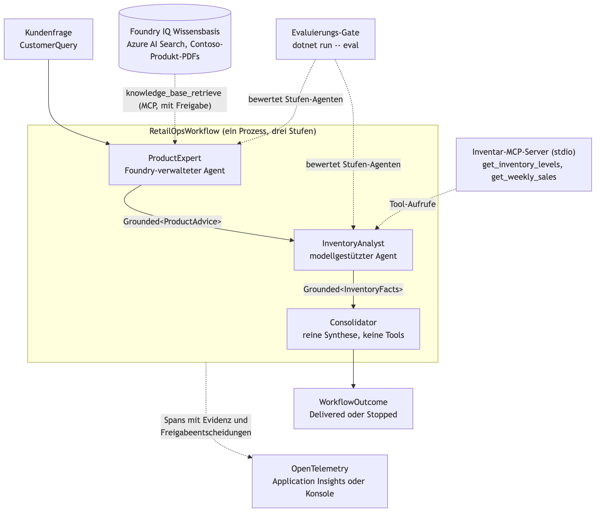
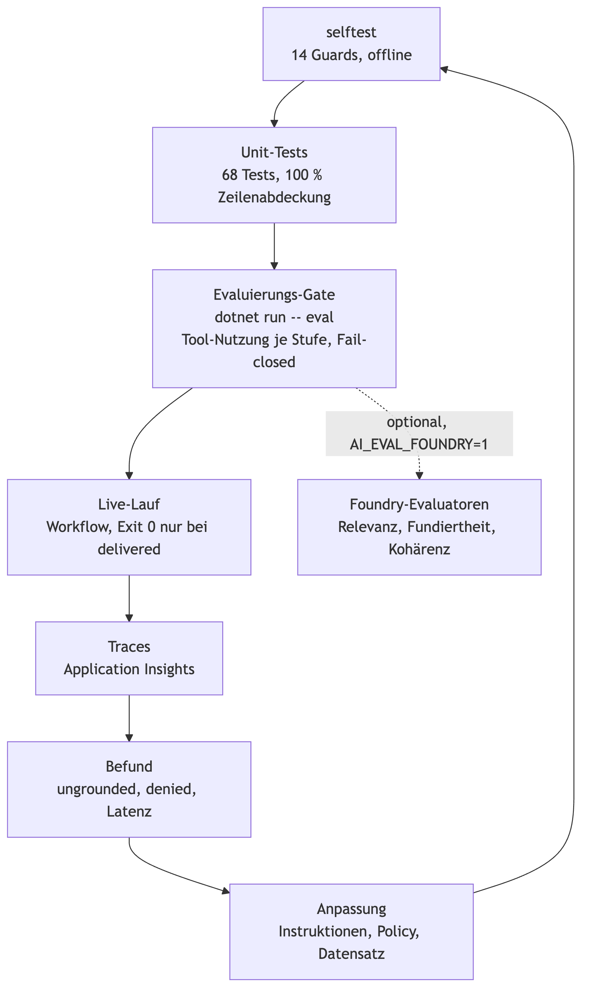
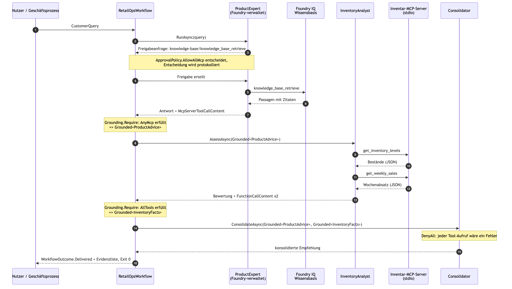

\newpage

# Zusammenfassung

Dieses Dokument beschreibt eine Multi-Agenten-Lösung für den Einzelhandel, die auf Microsoft Foundry und dem Microsoft Agent Framework für .NET aufbaut. Eine Kundenfrage („Ich brauche etwas gegen trockene Haut und Sonnenschutz. Was soll ich kaufen, und ist es vorrätig?“) durchläuft drei spezialisierte Agenten: einen Produktexperten, der ausschließlich aus einer Foundry-IQ-Wissensbasis antwortet, einen Bestandsanalysten, der Lagerbestand und Wochenabsatz über Model-Context-Protocol-Tools (MCP) liest, und einen Konsolidierer, der beide geprüften Ergebnisse zu einer Empfehlung für Kundschaft und Filiale zusammenführt.

Die Lösung ist vollständig implementiert und lauffähig. Der Quellcode liegt öffentlich unter <https://github.com/ANcpLua/grounded-agents>. Alle Belege in diesem Dokument (Selbsttest, Workflow-Lauf, Evaluierungs-Gate) stammen aus Läufen gegen eine echte Foundry-Umgebung am 3. September 2026.

Das Kernprinzip der Lösung: Die Übergabe zwischen den Agenten ist typisiert. Eine Stufe erhält nur Werte, die die vorherige Stufe nachweislich aus Tool-Aufrufen oder Wissensabrufen belegt hat. Fehlende Belege, offene Freigaben oder ungeprüfte Zwischenergebnisse sind im Typsystem nicht darstellbar. Was der Compiler nicht verhindern kann, prüfen ein Offline-Selbsttest, 68 Unit-Tests mit vollständiger Zeilenabdeckung und ein fail-closed Evaluierungs-Gate gegen die echten Agenten.

Die Kapitel folgen den drei Schritten der Aufgabenstellung: Lösungsdesign, Plan für die Produktionsreife (Beobachtbarkeit, Evaluierung, Governance) und End-to-End-Workflow. Ein Abschnitt zur Reflexion und ein Anhang mit Laufprotokollen schließen das Dokument ab.

# Lösungsdesign

## Geschäftsproblem

Eine Einzelhandelsfiliale beantwortet täglich Produktfragen, die zwei getrennte Wissensdomänen berühren: Was passt fachlich zum Bedarf der Kundin oder des Kunden, und ist es tatsächlich verfügbar? Heute liegt das Produktwissen in Katalogdokumenten, die Bestandsdaten im Warenwirtschaftssystem. Wer die Frage beantwortet, muss beides nachschlagen und dazu die operative Konsequenz ableiten: Muss nachbestellt werden, läuft ein Artikel aus, ist ein Ersatzprodukt sinnvoll?

Ein Sprachmodell allein löst das Problem nicht. Es erfindet Produkte, die es nicht gibt, und nennt Bestände, die es nie gelesen hat. Der geschäftliche Schaden entsteht nicht durch eine falsche Formulierung, sondern durch eine Empfehlung ohne Beleg. Das Ziel der Lösung ist daher nicht nur eine gute Antwort, sondern eine Antwort, deren Herkunft nachprüfbar ist.

## Vorgesehene Nutzerinnen und Nutzer

| Nutzergruppe | Bedarf | Was die Lösung liefert |
| --- | --- | --- |
| Verkaufspersonal in der Filiale | Eine belastbare Antwort für die Kundin oder den Kunden im Gespräch | Produktempfehlung mit Verfügbarkeit, in einem Absatz |
| Filialleitung und Disposition | Operative Signale aus dem Kundenkontakt | Nachbestell- und Abverkaufsempfehlungen mit den zugrunde liegenden Zahlen |
| Betrieb und Plattformteam | Nachvollziehbarkeit jeder Empfehlung | Trace je Lauf mit Evidenz, Freigabeentscheidungen und Urteil je Stufe |

Die Lösung ist als Backend-Workflow gebaut, der von einer Kassen- oder Beratungsanwendung aufgerufen wird. In der Referenzimplementierung ist der Aufrufer ein Konsolenprozess mit Exit-Code als Ergebnis, damit sich das Verhalten in Skripten und Pipelines prüfen lässt.

## Die drei Agenten

| Agent | Verantwortung und Betrieb | Werkzeuge und Wissen | Nachweispflicht und Freigaberegel |
|------------------|------------------------|------------------------|------------------------|
| **ProductExpert** | Fachliche Produktberatung aus dem Katalog. Foundry-verwalteter Agent, Definition liegt im Foundry-Projekt. | Foundry-IQ-Wissensbasis (Azure AI Search) über das MCP-Tool `knowledge_base_retrieve` | Mindestens ein Aufruf eines MCP-Servers. MCP-Aufrufe werden freigegeben, alles andere abgelehnt. |
| **InventoryAnalyst** | Bestand und Absatz prüfen, Nachbestellung oder Abverkauf empfehlen. Modellgestützter Agent im Prozess, Modell aus dem Foundry-Deployment. | Lokaler stdio-MCP-Server mit `get_inventory_levels` und `get_weekly_sales` | Beide Tools müssen aufgerufen worden sein. Jede Freigabeanfrage wird abgelehnt; sie ist hier nicht vorgesehen. |
| **Consolidator** | Beide geprüften Ergebnisse zu einer Empfehlung verbinden. Modellgestützter Agent im Prozess. | Keine Werkzeuge | Seine Fundierung sind die typisierten Eingaben. Jede Freigabeanfrage wird abgelehnt; ein Tool-Aufruf ist ein Fehler. |

Die Trennung folgt den Vertrauensgrenzen. Der Produktexperte hängt an einer Wissensquelle, die außerhalb des Prozesses verwaltet wird und deren Abrufe eine Freigabe verlangen. Der Bestandsanalyst hängt an Daten, die der Prozess selbst hostet und deren Aufrufe direkt ausgeführt werden. Der Konsolidierer darf gar nichts abrufen, weil jede weitere Quelle seine Aussage von den geprüften Eingaben lösen würde.

## Werkzeuge, Datenquellen und Wissensbasen

**Foundry-IQ-Wissensbasis.** Drei Contoso-Produktkataloge (PDF) liegen in einem Blob-Container. Eine Knowledge Source auf Azure AI Search extrahiert und indiziert sie mit dem Embedding-Modell `text-embedding-3-small`. Die Knowledge Base darüber liefert Passagen mit Zitaten und wird dem verwalteten Agenten als MCP-Tool angebunden, Freigabemodus „immer erforderlich“. Der Agent ist im Foundry-Projekt versioniert; der Workflow holt ihn beim Start über seinen Namen.

**Inventar-MCP-Server.** Die ausführbare Datei des Workflows startet sich selbst im Modus `--server` als stdio-MCP-Server und stellt zwei Tools bereit: aktuelle Bestände und Wochenabsatz je Produkt, als JSON. In der Referenzimplementierung sind das Beispieldaten; in Produktion ersetzt eine Anbindung an das Warenwirtschaftssystem die Implementierung der beiden Funktionen, ohne dass sich der Agent oder die Nachweispflicht ändert.

**Chat-Modell.** Bestandsanalyst und Konsolidierer laufen auf demselben Foundry-Deployment (`gpt-4o`). Die Wahl fiel bewusst nicht auf ein kleineres Modell: Die Nachweispflicht des Analysten verlangt, dass beide Tools in einem Durchlauf zuverlässig aufgerufen werden.

## Warum mehrere Agenten

Ein einzelner Agent mit Wissensbasis und Bestandstools könnte dieselbe Frage beantworten. Er könnte aber nicht nachweisen, dass jede Aussage aus der richtigen Quelle stammt. Ein Agent, der drei Tools hat, liefert am Ende einen Text und eine Liste von Tool-Aufrufen; ob die Produktaussage aus dem Katalog und die Bestandszahl aus dem Lager kommt, lässt sich der Antwort nicht mehr ansehen.

Die Aufteilung in drei Agenten macht diese Zuordnung zur Struktur der Lösung:

- **Nachweispflicht je Quelle.** Jede Stufe hat genau eine Nachweispflicht, die zu ihrer Quelle passt. Der Produktexperte muss einen MCP-Abruf vorweisen, der Analyst beide Bestandstools. Ein Sammelagent hätte nur eine Sammelpflicht.
- **Getrennte Freigaberegeln.** Die Wissensbasis verlangt Freigaben, die lokalen Tools nicht, der Konsolidierer darf keine haben. Drei Regeln für drei Agenten sind einfacher zu prüfen als eine Regel mit Ausnahmen.
- **Isolierte Evaluierung.** Das Evaluierungs-Gate bewertet Produktexperte und Analyst getrennt mit eigenen Fragen. Ein Fehlschlag zeigt sofort, welche Stufe und welche Quelle betroffen ist.
- **Unabhängige Weiterentwicklung.** Der verwaltete Agent wird im Foundry-Projekt versioniert und kann ohne Neubau des Prozesses geändert werden. Der Analyst ändert sich mit dem Warenwirtschaftssystem. Der Konsolidierer ändert sich mit den Anforderungen der Filiale.
- **Kleiner Schadensradius.** Ein Agent ohne Tools kann keine Daten abrufen, die er nicht haben soll. Ein Agent, der nur Bestände liest, kann nicht im Katalog suchen.

## Informationsfluss

{width=88%}

Die Kundenfrage geht als `CustomerQuery` in den Workflow. Der Produktexperte liefert `Grounded<ProductAdvice>`, ein Wert, der die Beratung zusammen mit dem Beleg des Wissensabrufs trägt. Der Analyst nimmt genau diesen Wert entgegen und liefert `Grounded<InventoryFacts>`. Der Konsolidierer verlangt beide und liefert die Empfehlung, wieder mit der vereinigten Evidenz beider Vorgänger. Das Ergebnis ist `WorkflowOutcome`, entweder `Delivered` mit Empfehlung und Evidenzliste oder `Stopped` mit Stufe und Grund.

Der Typ `Grounded<T>` ist der Kern des Designs. Er hat keinen öffentlichen Konstruktor, verlangt eine nicht leere Evidenzliste und wird nur von einer einzigen Funktion erzeugt, die prüft, ob die beobachteten Tool-Aufrufe die Nachweispflicht der Stufe erfüllen. Eine Stufe kann daher nicht mit einem Wert aufgerufen werden, den niemand belegt hat.

# Plan für die Produktionsreife

## Beobachtbarkeitsstrategie

### Was erfasst wird

Der Workflow veröffentlicht eine eigene OpenTelemetry-Quelle `RetailOpsWorkflow`. Jeder Lauf erzeugt einen Wurzel-Span und drei Stufen-Spans:

| Span | Attribute | Ereignisse |
| --- | --- | --- |
| `retail-ops.workflow` | `workflow.query`, `workflow.verdict` (`delivered` oder `stopped`), Fehlerstatus mit Stufe und Grund bei Abbruch | keine |
| `retail-ops.product-expert` | `workflow.stage.verdict`, `workflow.evidence.tools`, `workflow.approvals.total`, `workflow.approvals.denied`, bei Abbruch `workflow.stage.missing` | `approval.decision` je Freigabe mit Server, Tool, Entscheidung und Begründung |
| `retail-ops.inventory-analyst` | wie oben | wie oben |
| `retail-ops.consolidator` | wie oben | wie oben |

Zusätzlich sind die Aktivitätsquellen des Agent Framework, der Microsoft.Extensions.AI-Abstraktionen und des Azure SDK registriert, sodass Modellaufrufe und Credential-Vorgänge im selben Trace erscheinen können. Ist `APPLICATIONINSIGHTS_CONNECTION_STRING` gesetzt, exportiert der Prozess über den Azure-Monitor-Exporter nach Application Insights; sonst auf die Konsole, damit ein Lauf auch ohne Azure-Ressourcen lesbar bleibt.

Ein Ausschnitt aus dem Referenzlauf vom 3. September 2026 (Konsolen-Exporter):

```text
Activity.DisplayName:        retail-ops.product-expert
Activity.Duration:           00:00:11.9065000
Activity.Tags:
    workflow.stage.verdict: grounded
    workflow.evidence.tools: knowledge-base/knowledge_base_retrieve
    workflow.approvals.total: 1
    workflow.approvals.denied: 0
Activity.Events:
    approval.decision
        server: knowledge-base
        tool: knowledge_base_retrieve
        approved: true
        reason: managed agent's only tool is the Foundry IQ knowledge base

Activity.DisplayName:        retail-ops.inventory-analyst
Activity.Duration:           00:00:17.5036210
Activity.Tags:
    workflow.stage.verdict: grounded
    workflow.evidence.tools: get_inventory_levels,get_weekly_sales
    workflow.approvals.total: 0

Activity.DisplayName:        retail-ops.workflow
Activity.Duration:           00:00:33.6234930
Activity.Tags:
    workflow.verdict: delivered
```

### Welche Kennzahlen daraus abgeleitet werden

Die Spans sind so beschriftet, dass die betrieblich relevanten Kennzahlen als Abfragen über Application Insights entstehen, ohne zusätzlichen Code:

| Kennzahl | Quelle | Wozu |
| --- | --- | --- |
| Anteil `delivered` je Zeitfenster | `workflow.verdict` | Ergebnisqualität aus Sicht des Geschäftsprozesses |
| Abbrüche je Stufe und Grund | Fehlerstatus des Wurzel-Spans, `workflow.stage.missing` | Zeigt, welche Quelle oder welches Modellverhalten den Fluss stoppt |
| Ungrounded-Rate je Stufe | `workflow.stage.verdict` | Frühwarnung, wenn ein Modell Tools auslässt oder eine Wissensbasis nichts liefert |
| Abgelehnte Freigaben | `workflow.approvals.denied`, `approval.decision` | Sicherheitsrelevant: ein Agent versucht etwas, das seine Regel nicht erlaubt |
| Latenz je Stufe (Median, 95. Perzentil) | Span-Dauer | Kapazitätsplanung, Erkennung von Drosselung (HTTP 429) |
| Token- und Modellnutzung | Spans des Agent Framework | Kosten je Empfehlung |

### Wie die Erkenntnisse helfen

Die Attribute wurden so gewählt, dass die häufigsten Störungen an einem einzigen Span erkennbar sind:

- **Leere Evidenz beim Produktexperten** (`workflow.evidence.tools` ohne MCP-Aufruf): Die Wissensbasis ist nicht mehr als MCP-Tool angebunden, oder der Dienst hat serverseitig abgerufen, ohne den Aufruf zurückzumelden. Der Trace unterscheidet das von einem Modellfehler.
- **Nur ein Bestandstool** beim Analysten: Das Modell hat die Instruktion nicht befolgt. Das ist ein Fall für die Evaluierungsschleife (Abschnitt 3.2), nicht für den Betrieb.
- **Abgelehnte Freigabe** beim Konsolidierer: Der Agent hat versucht, ein Werkzeug zu nutzen, das er nicht hat. Das ist ein Instruktions- oder Konfigurationsfehler und wird sofort sichtbar, weil der Lauf mit Fehlerstatus abbricht.
- **Latenzsprung** in einer Stufe: Drosselung des Deployments oder ein langsamer Wissensabruf. Die Aufteilung nach Stufen zeigt direkt, ob das Modell oder die Suche betroffen ist.

In Produktion kämen Alarme auf zwei Signalen dazu: eine Ungrounded-Rate über einem Schwellwert und jede abgelehnte Freigabe. Beide sind Frühindikatoren für Fehlkonfiguration oder Modelldrift, die in der Antwort selbst nicht sichtbar wären.

## Evaluierungsstrategie

### Datensatz und Testansatz

Die Evaluierung ist in drei Schichten aufgebaut, von schnell und offline bis langsam und gegen echte Dienste:

1. **Selbsttest (offline, ohne Anmeldedaten).** Vierzehn Prüfungen treiben jeden Schutzmechanismus der Übergabegrenze in seinen unzulässigen Zustand und verlangen, dass er ablehnt: leere Konfiguration, Fundierung ohne Evidenz, unvollständige Tool-Evidenz, nicht gelistete MCP-Server, offene Freigaben. Laufzeit unter einer Sekunde.
2. **Unit-Tests (offline).** 68 Tests über die Domänentypen mit einem Coverage-Gate bei 100 Prozent Zeilenabdeckung des Workflow-Assemblys. Ein Skript-Agent mit vorgegebenen Antworten prüft die Freigabeschleife, die Evidenzextraktion und die Telemetrie-Anreicherung ohne Netzwerk.
3. **Evaluierungs-Gate (gegen die echten Agenten).** `dotnet run -- eval` führt je Stufe eine Suite mit Fragen aus dem Anwendungsbereich aus und bewertet die Antworten. Der Prozess endet nur dann mit Exit 0, wenn jede Stufe gelaufen ist und jedes Element bestanden hat.

Der Datensatz des Gates besteht in der Referenzimplementierung aus vier Fragen, zwei je tool-nutzender Stufe:

| Suite | Fragen | Prüfungen |
| --- | --- | --- |
| `product-expert-gate` | „What types of tents does Contoso offer?“, „Tell me about which backpacks are available in XL.“ | Antwort nicht leer; Nachweispflicht der Stufe erfüllt (ein MCP-Abruf) |
| `inventory-analyst-gate` | „Which products should we restock this week?“, „Is anything a candidate for clearance?“ | Antwort nicht leer; Nachweispflicht der Stufe erfüllt (beide Bestandstools) |

Der Datensatz wächst aus dem Betrieb: Jede Kundenfrage, die im Trace als `stopped` oder mit ungewöhnlicher Evidenz auffällt, wird als neues Element aufgenommen. So bewertet das Gate mit der Zeit genau die Fälle, die in der Praxis Probleme gemacht haben.

### Evaluierungskriterien

| Kriterium | Umsetzung | Schicht |
| --- | --- | --- |
| **Tool-Nutzung** | Die Nachweispflicht jeder Stufe (`ToolRequirement`) wird unverändert als Evaluierungsprüfung über das Transkript angewendet. Das Gate kann nicht von der Laufzeit abweichen, weil beide dieselbe Regel aufrufen. | Gate, lokal |
| **Aufgabenbefolgung** | Der Analyst muss beide Tools aufrufen, wie seine Instruktion verlangt; der Konsolidierer darf keines aufrufen. Beides wird als Evidenz beziehungsweise als abgelehnte Freigabe sichtbar. | Gate und Laufzeit |
| **Faktentreue und Fundiertheit** | Strukturell: Kein Wert erreicht die nächste Stufe ohne Evidenz. Inhaltlich: Foundry-Evaluator „Groundedness“ für den Produktexperten. | Laufzeit; Gate mit `AI_EVAL_FOUNDRY=1` |
| **Relevanz** | Foundry-Evaluator „Relevance“ für beide Stufen. | Gate mit `AI_EVAL_FOUNDRY=1` |
| **Kohärenz** | Foundry-Evaluator „Coherence“ für den Analysten. | Gate mit `AI_EVAL_FOUNDRY=1` |
| **Sicherheit** | Freigaben sind standardmäßig verweigert; jede Entscheidung wird protokolliert. Nicht gelistete Server und Nicht-MCP-Aufrufe werden abgelehnt. | Selbsttest, Unit-Tests, Laufzeit |

Die serverseitigen Foundry-Evaluatoren sind optional zuschaltbar, weil sie Zeit und Modellaufrufe kosten. Die lokalen Prüfungen laufen bei jedem Gate-Lauf.

### Eine Besonderheit des Gates

Das Gate bewertet die Agenten so, wie der Workflow sie ausführt. Jeder Agent ist in einen `SettledAgent` gehüllt, der jede Antwort unter der Freigaberegel der Stufe zur Abwicklung bringt und das vollständige Transkript zurückgibt. Ohne diese Hülle würde der verwaltete Agent, dessen Wissenstool eine Freigabe verlangt, dem Gate nur die Freigabeanfrage liefern, und die Bewertung würde einen Abruf prüfen, der nie stattgefunden hat.

Genau das war der Befund beim ersten Live-Lauf des Gates am 2. September 2026: Das Gate war rot, obwohl der Workflow grün lief. Zwei Ursachen: Das Gate fuhr den rohen Agenten ohne Freigabeschleife, und die eingebaute Tool-Prüfung des Frameworks zählte nur lokale Funktionsaufrufe, nicht MCP-Server-Aufrufe. Beides ist behoben, indem das Gate die Freigaberegel und die Nachweispflicht der Stufe direkt verwendet, statt sie nachzubilden.

### Integration in den Entwicklungslebenszyklus

{width=55%}

| Zeitpunkt | Was läuft | Bedingung zum Weitermachen |
| --- | --- | --- |
| Jeder Build | Build mit Warnungen als Fehler, Unit-Tests, Coverage-Gate | 0 Warnungen, alle Tests grün, 100 Prozent Zeilenabdeckung |
| Jeder Commit | `dotnet run -- selftest` | Exit 0 |
| Vor jedem Deployment | `dotnet run -- eval` gegen die Zielumgebung | Exit 0 |
| Nächtlich | `dotnet run -- eval` mit `AI_EVAL_FOUNDRY=1` | Berichte werden gesichtet; Verschlechterungen bei Relevanz oder Fundiertheit öffnen ein Ticket |
| Nach jeder Änderung am verwalteten Agenten | `dotnet run -- eval` | Exit 0, sonst bleibt die vorherige Agentenversion aktiv |

Der letzte Punkt ist wichtig, weil der Produktexperte außerhalb des Repositorys versioniert wird. Eine Änderung an seinen Instruktionen oder Tools im Foundry-Projekt löst keinen Build aus. Das Gate ist deshalb die Prüfung, die eine neue Agentenversion bestehen muss, bevor der Workflow sie verwendet.

Ein Ergebnis dieses Aufbaus, das schon vor dem ersten Live-Lauf eintrat: Die Unit-Tests fanden eine Endlosschleife in der Freigabeschleife. Offene Freigaben wurden gegen das gesamte Transkript statt gegen die aktuelle Runde geprüft, sodass eine bereits entschiedene Anfrage immer wieder als offen galt. Der Fehler wurde mit einem Skript-Agenten reproduziert und behoben, bevor ein echter Agent lief.

## Governance und Zuverlässigkeit

### Konsistente Ausgaben durch nicht darstellbare Fehlzustände

Die Übergabegrenze zwischen den Agenten ist als Typentwurf gebaut. Die Fehlzustände einer Agentenpipeline sind nicht darstellbar, statt zur Laufzeit geprüft zu werden:

| Unzulässiger Zustand | Warum er nicht darstellbar ist |
| --- | --- |
| Text aus einer Antwort mit offenen Freigaben lesen | `SettledResponse` hat keinen öffentlichen Konstruktor. Die einzigen Erzeuger verweigern die Konstruktion, solange eine Freigabe aussteht. |
| Eine „fundierte“ Antwort ohne Abrufbeleg | `Grounded<T>` entsteht nur in `Grounding.Require`, das die Tool-Evidenz gegen die Nachweispflicht der Stufe prüft; der Konstruktor lehnt leere Evidenz ab. |
| Ungeprüfte Aussagen konsolidieren | `ConsolidateAsync(Grounded<ProductAdvice>, Grounded<InventoryFacts>)` hat keine Überladung für rohe Zeichenketten. Die Signatur ist die Invariante. |
| Einen unerwarteten Tool-Aufruf freigeben | `ApprovalPolicy` ist eine geschlossene Vereinigung (`AllowServers`, `AllowAllMcp`, `DenyAll`), die standardmäßig verweigert. Jede Entscheidung wird protokolliert und als Telemetrie exportiert. |
| Halb konfiguriert starten | `FoundryBoundary.FromEnvironment` parst die gesamte Konfiguration einmal am Prozessrand in typisierte Werte; keine andere Datei liest eine Umgebungsvariable. |
| Eine Stufe überspringen | Die Eingabe jeder Stufe ist die fundierte Ausgabe der vorherigen. Es gibt keine andere Reihenfolge, die kompiliert. |

Die Ergebnisse sind geschlossene Vereinigungen (`StageOutcome<T>` mit `Success`, `Ungrounded`, `Failed`; `WorkflowOutcome` mit `Delivered`, `Stopped`). Jeder Aufrufer muss alle Fälle behandeln, und der Prozess endet mit Exit 1, sobald eine Stufe nicht geliefert hat.

### Sicheres Verhalten

- **Freigaben standardmäßig verweigert.** Nichts wird freigegeben, was eine Regel nicht ausdrücklich erlaubt. Der Produktexperte darf MCP-Aufrufe, weil sein einziges Werkzeug die Wissensbasis ist; Nicht-MCP-Aufrufe lehnt auch diese Regel ab. Analyst und Konsolidierer lehnen jede Freigabeanfrage ab.
- **Prüfbare Entscheidungen.** Jede Freigabeentscheidung trägt Server, Tool, Ergebnis und Begründung und landet als Ereignis im Span der Stufe.
- **Keine Geheimnisse im Code.** Endpunkt und Deployment kommen aus der Umgebung, die Authentifizierung aus `DefaultAzureCredential`. Für den Betrieb ist eine verwaltete Identität vorgesehen, auf Entwicklerrechnern die Azure-CLI-Anmeldung.
- **Getrennte Berechtigungen.** Der Suchdienst wird über die Projektidentität mit der Rolle „Search Index Data Reader“ gelesen. Die Projektverbindung zur Wissensbasis nutzt die verwaltete Identität des Projekts, nicht einen Schlüssel.

### Wartbarkeit

- Ein Build ohne Warnungen, 68 Tests, ein Coverage-Gate bei 100 Prozent Zeilenabdeckung und ein Selbsttest, der ohne Anmeldedaten läuft.
- Die Freigaberegel und die Nachweispflicht jeder Stufe sind statische Felder der Stufe. Laufzeit und Gate verwenden dieselben Objekte; es gibt keine zweite Definition, die veralten könnte.
- Der Evaluierungsrahmen ist als Quelltext eingebettet und von der Abdeckungsmessung ausgenommen; er wird nicht lokal geändert, sondern aus seiner Quelle synchronisiert.
- Markdown-Lint für die Dokumentation, zentrale Paketversionen, eine Solution-Datei für alle drei Projekte.

### Fundierung durch Wissensquellen und Werkzeuge

Die Wissensbasis und die Bestandstools sind nicht nur Datenquellen, sie sind die Beweismittel. Der Produktexperte antwortet nur aus der Wissensbasis; seine Instruktion verlangt eine Suche vor jeder Antwort, und die Nachweispflicht verlangt, dass diese Suche im Transkript steht. Der Analyst nennt Zahlen, die er aus den Tools gelesen hat; seine Nachweispflicht verlangt beide Aufrufe. Der Konsolidierer erhält beide Ergebnisse zusammen mit ihrer Evidenz im Prompt („Verified product advice (evidence: knowledge-base/knowledge_base_retrieve)“) und wird angewiesen, keine Produkte oder Zahlen zu erfinden. Die Evidenzliste der Empfehlung ist die Vereinigung der Evidenz beider Vorgänger und wird dem Aufrufer mit ausgegeben.

# End-to-End-Workflow

## Abfolge der Interaktionen

{width=100%}

1. Der Aufrufer übergibt die Kundenfrage als `CustomerQuery`. Leere Fragen werden bereits beim Konstruieren abgelehnt.
2. Der Workflow holt den verwalteten Produktexperten über seinen Namen aus dem Foundry-Projekt, öffnet eine Sitzung und sendet die Frage.
3. Der Agent antwortet mit einer Freigabeanfrage für `knowledge_base_retrieve` auf dem Server `knowledge-base`. Die Freigaberegel der Stufe entscheidet, protokolliert die Entscheidung und sendet sie in derselben Sitzung zurück.
4. Der Agent ruft die Wissensbasis ab und antwortet mit Beratung, Zitaten und dem Beleg des Aufrufs. Die Antwort ist abgewickelt, die Nachweispflicht erfüllt: `Grounded<ProductAdvice>`.
5. Der Analyst startet den Inventar-MCP-Server als Kindprozess, liest dessen Tool-Liste und erhält die Beratung als Prompt. Er ruft beide Tools auf und antwortet mit Beständen, Absatz und Empfehlung: `Grounded<InventoryFacts>`.
6. Der Konsolidierer erhält Frage, Beratung und Bestandsfakten mit ihrer Evidenz und formuliert die Empfehlung. Ein Tool-Aufruf würde abgelehnt und den Lauf beenden.
7. Der Workflow gibt `WorkflowOutcome.Delivered` mit Empfehlung und Evidenzliste zurück; der Prozess endet mit Exit 0.

## Übermittelte Informationen

| Von | An | Typ | Inhalt |
|-------------|-------------|--------------------------|----------------------------|
| Aufrufer | Workflow | `CustomerQuery` | Die Frage, nicht leer |
| ProductExpert | InventoryAnalyst | `Grounded<ProductAdvice>` | Frage, Beratungstext, Evidenz (der MCP-Abruf `knowledge_base_retrieve`), abgewickelte Antwort mit Freigabeentscheidungen und Transkript |
| InventoryAnalyst | Consolidator | `Grounded<InventoryFacts>` | Bewertungstext mit Zahlen je Produkt, Evidenz (`get_inventory_levels` und `get_weekly_sales`) |
| Consolidator | Aufrufer | `WorkflowOutcome` `.Delivered` | Empfehlung als `Grounded<string>` mit der vereinigten Evidenz beider Vorgänger |
| jede Stufe | Telemetrie | Span | Urteil, Evidenz, Freigabezähler, Freigabeereignisse, Dauer |

Bei einem Abbruch erhält der Aufrufer `WorkflowOutcome.Stopped` mit dem Namen der Stufe und dem Grund, zum Beispiel „answer lacked required evidence (all of get_inventory_levels, get_weekly_sales)“. Der Wurzel-Span trägt denselben Grund als Fehlerstatus.

## Tool-Aufrufe und Wissensabruf

| Stufe | Aufruf | Art | Freigabe | Beleg im Transkript |
|-----------------|---------------------------|--------------|------------|------------------------|
| ProductExpert | `knowledge_base_retrieve` | MCP-Tool des verwalteten Agenten | Erforderlich, erteilt | `McpServerToolCallContent` mit Servername |
| InventoryAnalyst | `get_inventory_levels` | Funktions-Tool, stdio-MCP | Keine | `FunctionCallContent` |
| InventoryAnalyst | `get_weekly_sales` | Funktions-Tool, stdio-MCP | Keine | `FunctionCallContent` |
| Consolidator | keiner | – | Jede Anfrage abgelehnt | – |

Der Abruf des Produktexperten geht an den MCP-Endpunkt der Knowledge Base und wird durch die Regel `AllowAllMcp` erteilt; die lokalen Tools werden direkt ausgeführt. Die Evidenzextraktion ist eine einzige Funktion, die beide Inhaltsarten kennt und MCP-Aufrufe mit ihrem Servernamen behält. Dieselbe Funktion nutzt das Evaluierungs-Gate.

## Endgültiges Ergebnis

Ausgabe des Referenzlaufs vom 3. September 2026 (Frage: „I need something for dry skin and sun protection. What should I buy, and is it in stock?“):

```text
=== Consolidated recommendation ===
**Recommendation for Customer:**
We currently recommend purchasing a combination of a moisturizer and
sunscreen for your dry skin and sun protection needs. [...]
- **Moisturizer**: Limited stock (6 units), please visit soon.
- **Sunscreen**: Healthy stock levels (14 units), available in-store now.

**Operational Action for Store:**
- **Moisturizer**: Restock immediately as inventory (6 units) is below 10
  and weekly sales (24 units) are high, indicating strong demand.
- **Sunscreen**: No action needed at this time as inventory (14 units) is
  sufficient for weekly sales (18 units). Monitor the levels going forward.
- **Lip Balm**: Restock (inventory is critically low at 4 units with
  21 weekly sales).
- **Body Spray and Face Wash**: Initiate clearance promotions to reduce
  overstock and clear slow-moving inventory.

Evidence:
  - knowledge-base/knowledge_base_retrieve
  - get_inventory_levels
  - get_weekly_sales
```

Exit-Code 0, Wurzel-Span mit `workflow.verdict: delivered`, Gesamtdauer 34 Sekunden, davon 12 Sekunden Produktexperte, 18 Sekunden Analyst, 4 Sekunden Konsolidierer.

Die Zahlen in der Empfehlung sind genau die Zahlen, die die beiden Tools geliefert haben, und die operativen Regeln (Nachbestellung unter 10 Stück bei mehr als 15 Verkäufen, Abverkauf über 20 Stück bei weniger als 5 Verkäufen) stammen aus der Instruktion des Analysten. Die Wissensbasis der Referenzumgebung enthält die Contoso-Beispielkataloge aus dem Kurs, die Bestandsdaten die Beispielprodukte aus dem MCP-Kapitel; beide sind Platzhalter für die Katalog- und Warenwirtschaftsdaten einer echten Filiale.

## Bereitstellung, Überwachung, Bewertung und Verbesserung über die Zeit

**Bereitstellung.** Der Workflow ist ein einzelner .NET-Prozess, der seinen MCP-Server selbst hostet. Er wird als Container in Azure Container Apps oder als Foundry-gehosteter Agent bereitgestellt; die Konfiguration besteht aus drei Umgebungsvariablen und einer verwalteten Identität. Der Produktexperte wird im Foundry-Projekt versioniert; der Workflow verwendet die als aktuell markierte Version. Ein Rollback des Agenten ist ein Versionswechsel im Projekt, kein Deployment.

**Überwachung.** Application Insights als Ziel der Traces, Dashboards für die Kennzahlen aus Abschnitt 3.1, Alarme auf Ungrounded-Rate und abgelehnte Freigaben. Die Stufen-Spans zeigen, ob Modell, Suche oder Bestandsdaten die Latenz treiben.

**Bewertung.** Das Gate läuft vor jedem Deployment und nach jeder Änderung am verwalteten Agenten; die Foundry-Evaluatoren laufen nächtlich. Auffällige Läufe aus der Überwachung erweitern den Datensatz.

**Verbesserung.** Die Schleife ist in Abbildung 2 dargestellt. Ein Befund aus dem Betrieb (etwa: der Analyst lässt bei bestimmten Fragen ein Tool aus) wird als Frage in den Datensatz aufgenommen, das Gate wird rot, die Instruktion wird angepasst, das Gate wird grün, das Deployment folgt. Weil Nachweispflicht und Freigaberegel im Code stehen, ist jede Verschärfung eine Codeänderung mit Test, und weil das Gate dieselben Objekte verwendet, kann es nicht lockerer prüfen als die Laufzeit.

# Reflexion

Der Weg vom Prototyp zur produktionsreifen Architektur folgte den Kursthemen in ihrer Reihenfolge, aber jedes Thema hat die Lösung an einer konkreten Stelle verändert.

**Agenten mit Wissensquellen und Tools** (Kapitel 1 und 2 des Repositorys) waren als Einzelanwendungen fertig, bevor der Workflow entstand. Der entscheidende Schritt war die Frage, was von einem Agenten zum nächsten übergeben wird. Die Antwort „ein Text“ war nicht ausreichend, weil ein Text nicht trägt, woher er kommt. Daraus entstand `Grounded<T>`.

**Beobachtbarkeit** hat die Attribute der Spans bestimmt. Die erste Version hatte nur Dauer und Namen. Erst die Frage „Was muss ich im Trace sehen, um einen Abbruch ohne Debugger zu verstehen?“ führte zu Evidenzliste, Freigabezählern und Urteil je Stufe.

**Evaluierung** hat zwei Fehler gefunden, bevor sie Kundschaft erreicht hätten: die Endlosschleife in der Freigabeschleife, die ein Unit-Test mit einem Skript-Agenten reproduzierte, und das rote Gate, das den rohen Agenten ohne Freigabeschleife bewertete. Der zweite Fall ist lehrreich, weil das Gate selbst falsch war, nicht der Workflow. Die Lösung, das Gate mit denselben Objekten wie die Laufzeit zu bauen, ist die wichtigste Entwurfsentscheidung des Projekts nach `Grounded<T>`.

**Governance** war am Ende weniger ein Regelwerk als eine Reihe von Typen, die bestimmte Aufrufe nicht zulassen. Das hat einen praktischen Vorteil: Die Regeln müssen nicht in einem Dokument gepflegt werden, das vom Code abweichen kann. Dieses Dokument beschreibt sie, aber der Compiler durchsetzt sie.

Was bei einem Neuaufbau anders gemacht würde: Die Wissensbasis und der verwaltete Agent wurden per API-Skript provisioniert, weil das Portal in der Referenzumgebung nicht alle Optionen bot. Diese Skripte gehören in den Lieferumfang, damit ein Gate-Lauf in einer frischen Umgebung ohne Handarbeit möglich ist. Außerdem wäre eine Instrumentierung der Modellaufrufe mit Token-Zahlen von Anfang an sinnvoll gewesen; sie ist über die registrierten Quellen des Agent Framework vorbereitet, aber im Referenzlauf noch nicht Teil der ausgegebenen Spans.

\newpage

# Anhang

## Repository und Befehle

Quellcode: <https://github.com/ANcpLua/grounded-agents>

```text
Hosted-FoundryIQ/              Kapitel 1: verwalteter Agent mit Foundry-IQ-Wissensbasis
Hosted-FoundryMcpTools/        Kapitel 2: entferntes MCP-Tool und lokaler stdio-MCP-Server
Hosted-FoundryWorkflow/        Kapitel 3: der Multi-Agenten-Workflow
  Boundary.cs                  Typisierte Konfiguration, einmal am Prozessrand geparst
  Approvals.cs                 Abwicklung und die Freigaberegel (standardmäßig verweigert)
  Grounding.cs                 Grounded<T>, Nachweispflichten, Stufenergebnisse
  Agents.cs                    ProductExpert, InventoryAnalyst, Consolidator
  Workflow.cs                  Stufenfolge und das Workflow-Ergebnis
  Telemetry.cs                 OpenTelemetry-Quelle und Span-Anreicherung
  InventoryMcp.cs              Der stdio-Inventar-MCP-Server und seine Tools
  SettledAgent.cs              Ein Agent, wie der Workflow ihn ausführt
  RequirementChecks.cs         Die Nachweispflichten als Evaluierungsprüfungen
  EvalGate.cs                  Das fail-closed Evaluierungs-Gate
Hosted-FoundryWorkflow.Tests/  68 Tests, Coverage-Gate bei 100 Prozent
docs/                          Dieses Dokument und die Diagrammquellen
```

```bash
cd Hosted-FoundryWorkflow
dotnet run -- selftest       # offline, ohne Anmeldedaten
dotnet run -- "<Frage>"      # der vollständige Workflow
dotnet run -- eval           # das Evaluierungs-Gate
AI_EVAL_FOUNDRY=1 dotnet run -- eval   # zusätzlich Foundry-Evaluatoren
```

## Protokoll des Selbsttests

```text
  [OK] empty query => throws
  [OK] empty deployment name => throws
  [OK] missing environment => throws, no half-configured boundary
  [OK] grounded value without evidence => not constructible
  [OK] AllOf requirement with partial evidence => Ungrounded
  [OK] AnyMcp requirement with only local tools => Ungrounded
  [OK] satisfied requirement => Success carries the evidence
  [OK] allow-list policy denies unlisted server by default
  [OK] allow-list policy approves listed server
  [OK] allow-all-mcp policy still denies non-MCP calls
  [OK] deny-all policy denies everything
  [OK] pending approval => response is not settled
  [OK] no pending content => settles with extracted evidence
  [OK] full policy path denies unlisted server on real content

selftest: all boundary guards fired correctly.
```

## Protokoll des Evaluierungs-Gates

```text
=== product-expert-gate ===
  -- local --
    [PASS] What types of tents does Contoso offer?
    [PASS] Tell me about which backpacks are available in XL.
  -> product-expert-gate: 2 passed, 0 failed, 0 errored of 2

=== inventory-analyst-gate ===
  -- local --
    [PASS] Which products should we restock this week?
    [PASS] Is anything a candidate for clearance?
  -> inventory-analyst-gate: 2 passed, 0 failed, 0 errored of 2

eval gate: green, every stage ran and every item passed.
```

## Testabdeckung

| Testdatei | Tests | Gegenstand |
| --- | --- | --- |
| ApprovalPolicyTests | 15 | Freigaberegeln, Abwicklungsschleife, Protokollierung der Entscheidungen |
| GroundingTests | 11 | `Grounded<T>`, Nachweispflichten, Stufenergebnisse |
| BoundaryTests | 10 | Typisierte Konfiguration, Ablehnung leerer Werte |
| TelemetryTests | 8 | Span-Attribute und Ereignisse je Ergebnis |
| SettlementTests | 6 | Klassifizierung offener Freigaben, Evidenzextraktion |
| SettledAgentTests | 4 | Der Agent, wie der Workflow ihn ausführt |
| RequirementChecksTests | 4 | Nachweispflichten als Evaluierungsprüfungen |
| WorkflowOutcomeTests | 4 | Geschlossene Ergebnisvereinigung |
| InventoryToolsTests | 3 | Die beiden Bestandstools |
| Gesamt | 68 | Zeilenabdeckung des Workflow-Assemblys: 100 Prozent |

## Referenzumgebung

Foundry-Projekt mit den Deployments `gpt-4o` (Chat) und `text-embedding-3-small` (Embedding), Azure AI Search (Free-Tier) mit Knowledge Source und Knowledge Base über einem Blob-Container mit drei Contoso-Produkt-PDFs, verwalteter Agent `product-expert-agent` mit dem MCP-Tool `knowledge_base_retrieve` im Freigabemodus „immer erforderlich“. Ressourcennamen, Endpunkte und Schlüssel sind absichtlich nicht Teil dieses Dokuments.
